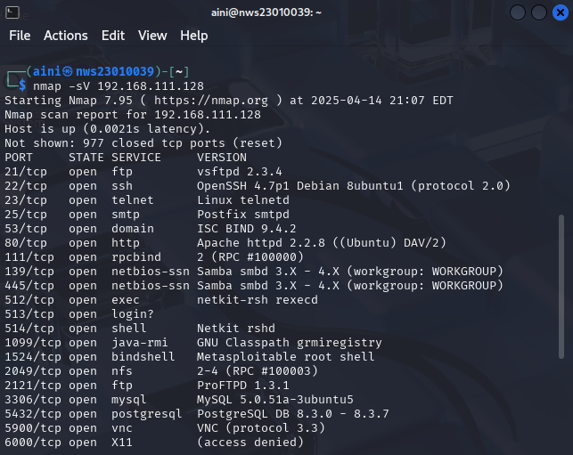
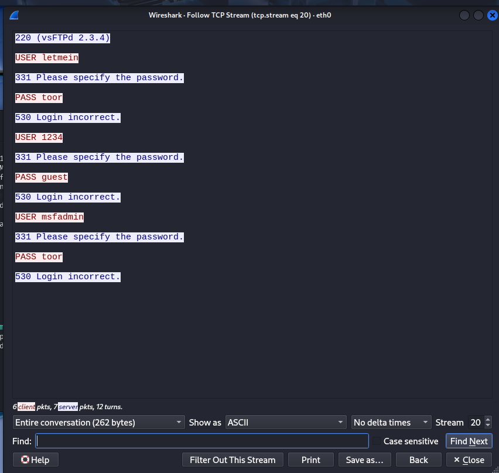
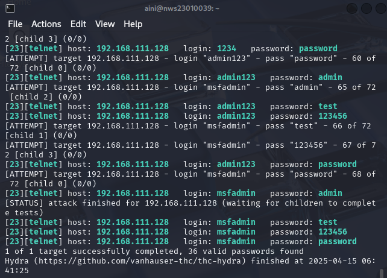
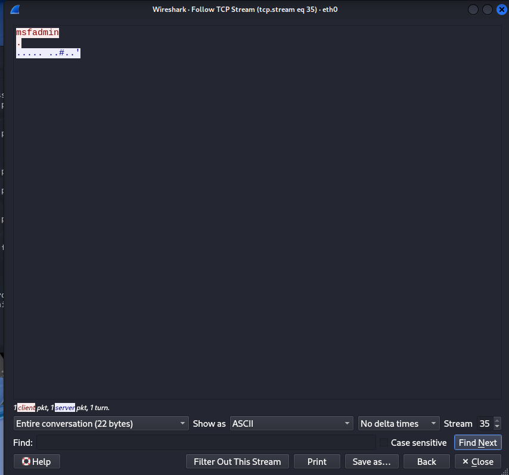

# LABWORK-1
# Lab Tasks

## 1. Enumerate the Vulnerable VM to Discover Usernames


### Objective:
Identify potential usernames that could be targeted in brute force attacks.


### Steps:
- Perform a service enumeration scan using tools like **Nmap** or **Nikto** to identify open ports and services running on the vulnerable VM.
- Use techniques such as directory brute-forcing or username enumeration to gather potential usernames.
- Document all discovered usernames and note their associated services (FTP, TELNET, SSH, HTTP).


### Tools Used:
- **Nmap**: For service and port enumeration.


First, scan a target to discover open ports

```bash
nmap -sV <TARGET_IP>
```

()


## 2. Perform Brute Force Attacks

### 2.1. FTP, TELNET, and SSH

### Objective:
Perform brute force attacks against the FTP, TELNET, and SSH services to gain unauthorized access.


### Tools Used:
- **Hydra**
- **Medusa**
- **NetExec**


But,for this lab I used Hydra

#### Before perform brute force attacks, make sure you have:

- A **list of usernames** (`userlist.txt`)
- A **list of passwords** (`mypass.txt`)

You a=can make this lists as your own lists using command :

 ```bash
  nano userlist.txt
```
and

 ```bash
  nano mypass.txt
```
 or

 
> You can use default ones from Kali:
```bash
/usr/share/wordlists/rockyou.txt
```


- For **FTP**:
  ```bash
  hydra -l userlist.txt -P my pass.txt ftp://<TARGET_IP> -t 4 -vV


**Explanation:**
- `-L userlist.txt`: Specifies the file containing the usernames.

- `-P mypass.txt`: Specifies the file containing the passwords.

- `ftp://192.168.111.128:21`: Targets the FTP service at IP address 192.168.111.128 on port 21.

- `-t 4`: Specifies the number of parallel tasks (threads). You can adjust this number depending on your system's performance and the target server's response.

- `-vV`: Enables verbose output, showing detailed login attempts.


 For **TELNET**:

  ```bash
  hydra -l userlist.txt -P my pass.txt telnet://<TARGET_IP> -t 4 -vV -w 3
```


**Explanation:**

- `-L userlist.txt`: Specifies the file containing the usernames.

- `-P mypass.txt`: Specifies the file containing the passwords.

- `telnet://192.168.111.128:21`: Targets the TELNET service at IP address 192.168.111.128 

- `-t 4`: Specifies the number of parallel tasks (threads). You can adjust this number depending on your system's performance and the target server's response.

- `-vV`: Enables verbose output, showing detailed login attempts.

- `-w 3`: Sets a 3-second wait time between each login attempt.


For **SSH**:

  ```bash
  medusa -h 192.168.111.128 -U userlist.txt -P mypass.txt -M ssh  
```


**Explanation:**

- `-h 192.168.111.128`: Specifies the target host IP address (192.168.111.128) that Medusa will attack. In this case, it's targeting the SSH service on that IP.

- `-U userlist.txt`: Specifies the file containing the list of usernames (userlist.txt). Each line in the file should have one username that Medusa will try to log in with.

- `-P mypass.txt`: Specifies the file containing the list of passwords (mypass.txt). Each line in this file should have one password that Medusa will try for each username.

- `-M ssh`: Tells Medusa to target the SSH service for brute-force attempts. This is a module that tells Medusa to use SSH as the protocol for login attempts.

- `-t 4`: Runs 4 parallel tasks (threads) for faster brute-forcing.

- `-vV`: Shows detailed login attempts in real-time.

- `-w 3`: Sets a 3-second wait time between each login attempt.


## 2.2 HTTP

### Objective:

To automate brute force attacks against an HTTP login page.
Configure Intruder to test a list of usernames and passwords.
Analyze the results to identify successful logins.

## 1. Open burpsuite on kali linux.Make  sure to turn the intercept on.


## 2. Open https://testphp.vulnweb.com/ on web inside the burp suite


## 3. Then,send the intercept inside the proxy to intruder


## 4. Switch to Cluster Bomb attack type and Set payload positions on both username and password fields.


## 5. Start attack.


**Explanation:**

- `200`:= OK

 Meaning: The request was successful.

Example: You accessed a valid page and the server responded properly.


- `302`:= Found (Redirect)

Meaning: The server is redirecting you to another page.

Example: Trying to access a page and getting redirected to a login page or homepage.


- `404`:= Not Found

Meaning: The page or resource does not exist.

Example: You tried to access a page like /admin123 that doesn’t exist.




plaintext





encryption


