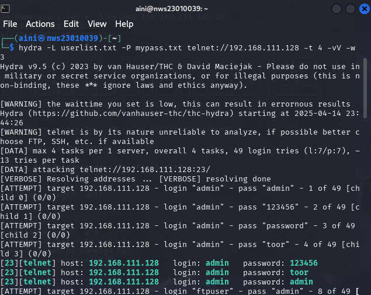
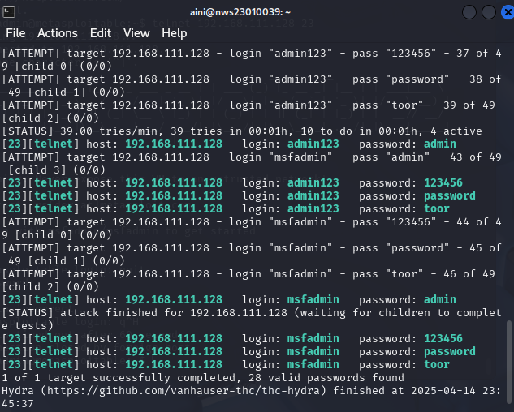
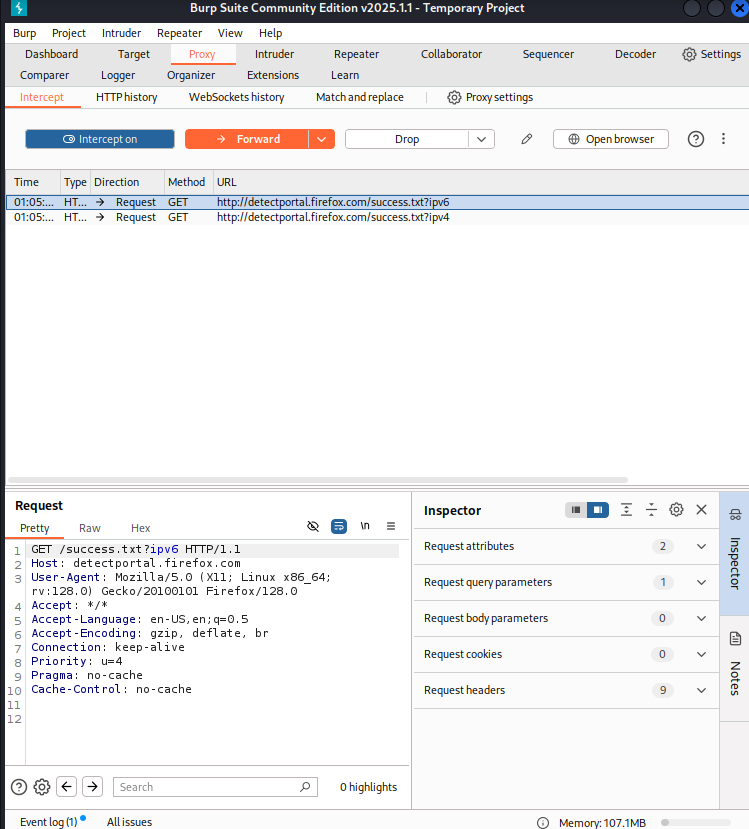
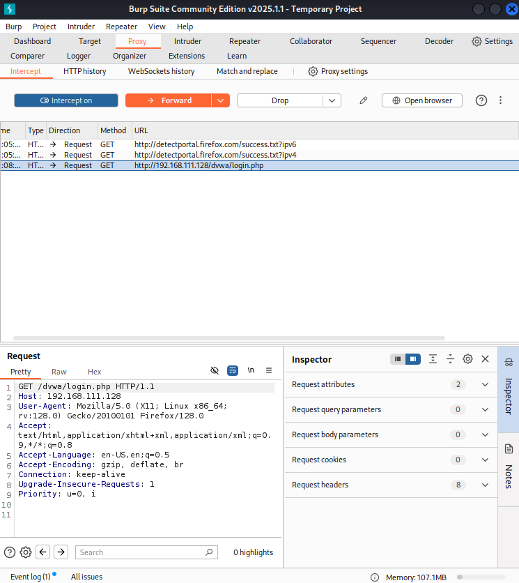
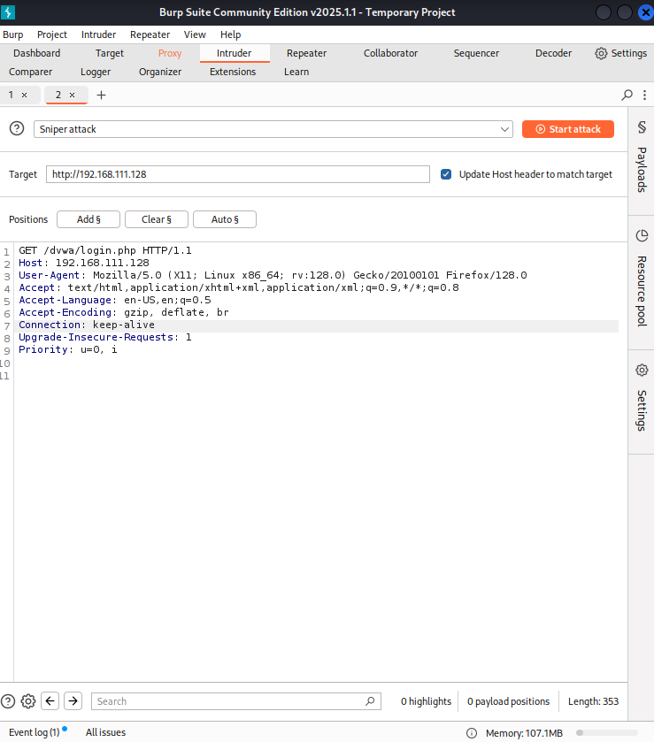
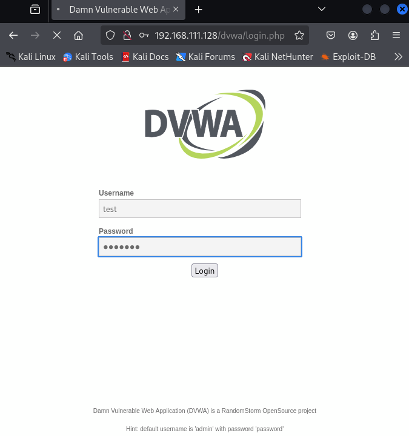
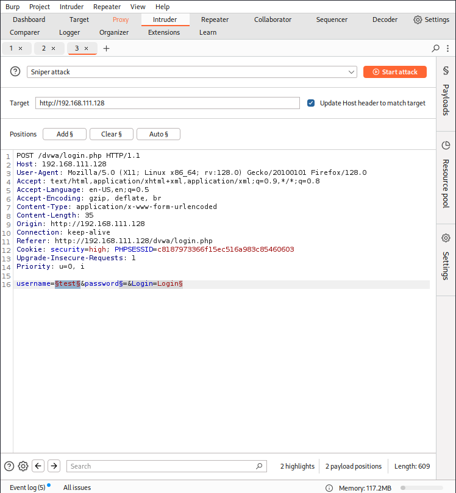

# LABWORK-1
# Lab Tasks

## 1. Enumerate the Vulnerable VM to Discover Usernames


### Objective:
Identify potential usernames that could be targeted in brute force attacks.


### Steps:
- Perform a service enumeration scan using tools like **Nmap** or **Nikto** to identify open ports and services running on the vulnerable VM.
- Use techniques such as directory brute-forcing or username enumeration to gather potential usernames.
- Document all discovered usernames and note their associated services (FTP, TELNET, SSH, HTTP).


### Tools Used:
- **Nmap**: For service and port enumeration.


First, scan a target to discover open ports

```bash
nmap -sV <TARGET_IP>
```

()


## 2. Perform Brute Force Attacks

### 2.1. FTP, TELNET, and SSH

### Objective:
Perform brute force attacks against the FTP, TELNET, and SSH services to gain unauthorized access.


### Tools Used:
- **Hydra**
- **Medusa**
- **NetExec**


But,for this lab I used Hydra

#### Before perform brute force attacks, make sure you have:

- A **list of usernames** (`userlist.txt`)
- A **list of passwords** (`mypass.txt`)

You a=can make this lists as your own lists using command :

 ```bash
  nano userlist.txt
```
and

 ```bash
  nano mypass.txt
```
 or

 
> You can use default ones from Kali:
```bash
/usr/share/wordlists/rockyou.txt
```


- For **FTP**:
  ```bash
  hydra -l userlist.txt -P my pass.txt ftp://<TARGET_IP> -t 4 -vV


**Explanation:**
- `-L userlist.txt`: Specifies the file containing the usernames.

- `-P mypass.txt`: Specifies the file containing the passwords.

- `ftp://192.168.111.128:21`: Targets the FTP service at IP address 192.168.111.128 on port 21.

- `-t 4`: Specifies the number of parallel tasks (threads). You can adjust this number depending on your system's performance and the target server's response.

- `-vV`: Enables verbose output, showing detailed login attempts.


 For **TELNET**:

  ```bash
  hydra -l userlist.txt -P my pass.txt telnet://<TARGET_IP> -t 4 -vV -w 3








**Explanation:**
- `-L userlist.txt`: Specifies the file containing the usernames.

- `-P mypass.txt`: Specifies the file containing the passwords.

- `telnet://192.168.111.128:21`: Targets the TELNET service at IP address 192.168.111.128 

- `-t 4`: Specifies the number of parallel tasks (threads). You can adjust this number depending on your system's performance and the target server's response.

- `-vV`: Enables verbose output, showing detailed login attempts.

- `-w 3`: Sets a 3-second wait time between each login attempt.










